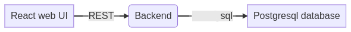

# DEMO expenses backend app with quarkus 

Simple applicaiton workflow:



you can find front-end gui here: https://github.com/nmajorov/expenses-web-ui

This project uses Quarkus, the Supersonic Subatomic Java Framework.

If you want to learn more about Quarkus, please visit its website: https://quarkus.io/ .

## Running the application in dev mode

You can run your application in dev mode that enables live coding using:
```
./mvnw quarkus:dev
```

## Packaging and running the application

The application can be packaged using `./mvnw package`.
It produces the `code-with-quarkus-1.0.0-SNAPSHOT-runner.jar` file in the `/target` directory.
Be aware that it’s not an _über-jar_ as the dependencies are copied into the `target/lib` directory.

The application is now runnable using `java -jar target/code-with-quarkus-1.0.0-SNAPSHOT-runner.jar`.

## Creating a native executable

**At the moment it's only working with madrel or graalvm version 21.3!!!**

You can create a native executable using: `./mvnw package -Pnative`.

Or, if you don't have GraalVM installed, you can run the native executable build in a container using: `./mvnw package -Pnative -Dquarkus.native.container-build=true`.

You can then execute your native executable with: `./target/code-with-quarkus-1.0.0-SNAPSHOT-runner`

If you want to learn more about building native executables, please consult https://quarkus.io/guides/building-native-image.


## OpenShift pipelines troubleshooting 
Sometimes database migration  get problem with old schema files especially  after OpenShift update.

Run this statement:

    DROP SCHEMA IF EXISTS expenses CASCADE;

